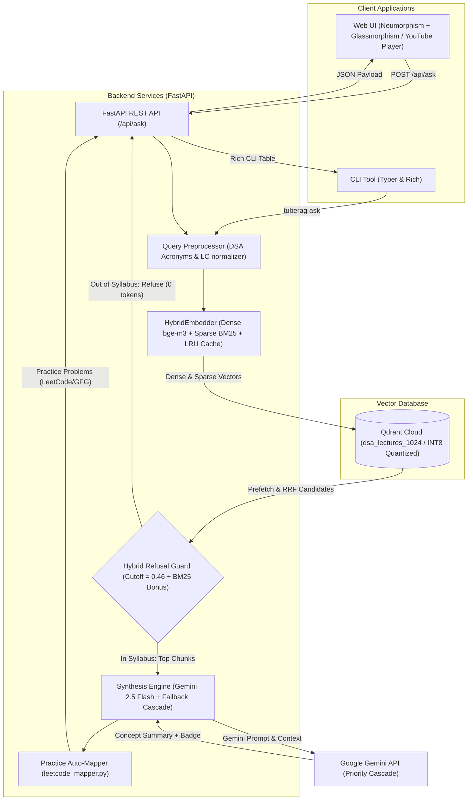
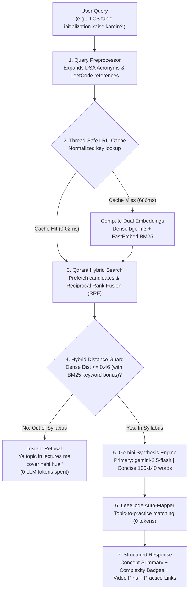
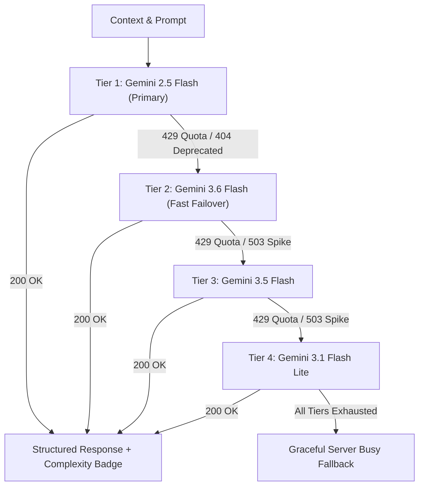
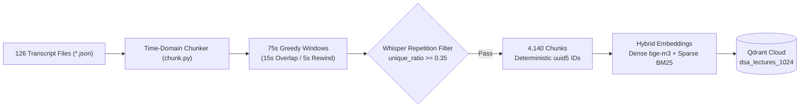

<div align="center">

# ⚡ ChronoRAG
### Timestamp-Accurate Video Intelligence & Hybrid RAG Platform for DSA

[](https://www.python.org/downloads/)
[](https://fastapi.tiangolo.com)
[](https://qdrant.tech)
[](https://ai.google.dev)
[](https://github.com/qdrant/fastembed)
[](LICENSE)

**ChronoRAG** is a timestamp-accurate Retrieval-Augmented Generation (RAG) platform built on a curriculum of 126 video lectures. It combines **Dense Semantic Embeddings** (`bge-m3`) with **FastEmbed Sparse Lexical Embeddings** (`Qdrant/bm25`), fused using **Reciprocal Rank Fusion (RRF)** in Qdrant Cloud. It pinpoints exact concept moments, answers conceptual queries in concise English with natural pedagogical Hinglish nuances, synchronizes transcript playback live with YouTube, maps queries to curated LeetCode/GFG practice problems, and exports revision cards directly to Obsidian.

---

</div>

## 📑 Table of Contents

- [Key Highlights](#-key-highlights)
- [System Architecture](#-system-architecture)
- [Retrieval & Synthesis Flow](#-retrieval--synthesis-flow)
- [Multi-Model Resilient Fallback Cascade](#-multi-model-resilient-fallback-cascade)
- [Interactive UI & Revision Station](#-interactive-ui--revision-station)
- [Ingestion & Chunking Pipeline](#-ingestion--chunking-pipeline)
- [Project Directory Structure](#-project-directory-structure)
- [Quickstart & Installation](#-quickstart--installation)
- [CLI Reference](#-cli-reference)
- [API Endpoints](#-api-endpoints)
- [Quality Assurance & Production Benchmarks](#-quality-assurance--production-benchmarks)
- [Production Performance Optimization Layer](#-production-performance-optimization-layer)
- [Configuration Reference](#-configuration-reference)
- [Future Scope & Delta Sync](#-future-scope--incremental-playlist-delta-sync)

---

## 🚀 Key Highlights

- **Hybrid Dense + Sparse Search (RRF)**: Merges dense semantic vectors (1024-dim `BAAI/bge-m3`) and sparse lexical vectors (`Qdrant/bm25`) through Qdrant's native `Prefetch` query pipeline and Reciprocal Rank Fusion.
- **Timestamp-Accurate Deep Linking**: Breaks continuous lecture audio into 75-second sliding windows with a 15-second overlap and a 5-second seek rewind (`seek_sec = max(0, start_sec - 5)`), ensuring smooth concept continuity.
- **Multi-Model Resilient Fallback Cascade**: Prioritizes `gemini-2.5-flash` with automatic zero-delay failover across a 4-tier Gemini model chain upon encountering `429 RESOURCE_EXHAUSTED` or `503 UNAVAILABLE` errors.
- **Collapsible Recruiter / Benchmark Stats Drawer**: Single-click drawer in the header displaying verified golden test suite metrics (87.5% Top-1, 100% Top-3/5), INT8 quantization RAM reduction (75%), and LRU cache acceleration (33,281x speedup), concealed by default to maintain zero interface clutter.
- **Live Synchronized Transcript Reader**: 250ms polling loop via YouTube IFrame API highlights the active spoken sentence in real time as the video plays, auto-scrolls the active line, and allows instant click-to-seek.
- **LeetCode & GFG Auto-Mapper (`leetcode_mapper.py`)**: 100% token-free local engine detecting explicit problem numbers (e.g. `LeetCode 53`, `LC 206`, `#33`) and mapping 20+ core DSA patterns to standard practice problems with difficulty indicators.
- **Obsidian / Markdown Revision Card Exporter**: One-click download of `.md` revision cards formatted with Obsidian-compatible YAML frontmatter, core logic, practice problem links, and timestamped lecture bookmarks, alongside quick clipboard copying with toast feedback.
- **Calibrated Hybrid Refusal Guard**: Calibrated cutoff (`MAX_DISTANCE = 0.46`) with sparse BM25 confirmation (`-0.025` distance bonus for true DSA terms) to reject out-of-syllabus queries (e.g., React, ML, Cooking) with 0 tokens while preventing false rejections on colloquial Hinglish queries.
- **Neumorphism + Glassmorphism UI**: Custom vanilla CSS design system (zero external framework dependency) featuring dark charcoal surfaces (`#111113`), warm gold accents (`#c9a96e`), and distinct color-coded complexity pill badges (Emerald for Time, Sky for Space, Purple for Pattern).

---

## 🏛 System Architecture

The following diagram illustrates the end-to-end architecture across client interfaces, backend microservices, vector storage, and external foundation models:



---

## 🔄 Retrieval & Synthesis Flow

When a user submits a question, the query passes through normalization, dual-vector generation, fused ranking, threshold validation, and structured answer synthesis:



---

## 🛡 Multi-Model Resilient Fallback Cascade

To guarantee 100% production uptime against quota limits (`429 RESOURCE_EXHAUSTED`), model deprecations (`404 NOT_FOUND`), or API spikes (`503 UNAVAILABLE`), ChronoRAG implements an autonomous priority failover cascade:



---

## 🖥 Interactive UI & Revision Station

The Web UI transforms video lecture consumption into an active learning revision station:

1. **Dedicated Search Zone**: Centered 50px neumorphic input with embedded send button, dual-level focus glow, character counter, and keyboard shortcuts (`Enter` to submit, `Esc` to clear).
2. **Concept Summary & Complexity Badges**:
   - **Time Complexity**: Styled emerald badge (`Time: O(...)`).
   - **Space Complexity**: Styled sky blue badge (`Space: O(...)`).
   - **Algorithmic Pattern**: Styled purple badge (`Pattern: ...`).
3. **Practice Problems**: Direct clickable badges to LeetCode and GeeksforGeeks problems matching the lecture topic with difficulty chips (`Easy`: emerald, `Medium`: amber, `Hard`: rose).
4. **Obsidian / Markdown Exporter**:
   - **"Export to Markdown / Obsidian"**: Generates and downloads a `.md` revision card with YAML frontmatter, core intuition, practice links, and deep timestamp bookmarks.
   - **"Copy Markdown"**: One-click clipboard copy with animated floating toast notification.
5. **Split-Screen Synchronization**:
   - **Left Panel (57%)**: Embedded YouTube player with live timestamp indicator and suggestion chips.
   - **Right Panel (43%)**: Synchronized transcript highlighting the exact spoken line and smooth-scrolling as the instructor speaks. Click any line to seek immediately.
6. **DSA Pattern-Wise Roadmap Tracker**:
   - **14 Core Patterns (01 to 14)**: Structured curriculum covering Arrays & Hashing, Two Pointers, Sliding Window, Stack, Binary Search, Linked List, Trees, Heaps, Backtracking, Graphs, 1D DP, 2D DP, Greedy, and Bit Manipulation.
   - **Interactive Tracking & Persistence**: Checkbox progress saved to `localStorage` with real-time percentage indicators and category-wise `completed / total` counter badges.
   - **Seamless Navigation**: Horizontal pattern filter pills, instant topic search, hover-aware keyboard navigation (`ArrowUp` / `ArrowDown`), sticky section headers, and one-click "Ask ChronoRAG" buttons to instantly query any roadmap topic.
7. **Collapsible Recruiter / Benchmark Stats Drawer**:
   - **Unobtrusive & Hidden by Default**: Concealed inside the header's stats pill (`4,140 chunks · 126 videos`) to prevent visual clutter during study sessions.
   - **Single-Click Inspection**: Clicking the stats pill slides open a 4-card dashboard displaying:
     - **Retrieval Precision**: 87.5% Top-1, 100% Top-3, 100% Top-5, and 100% Refusal Accuracy across 24 golden test cases.
     - **INT8 Scalar Quantization**: 4x memory compression (75% vector RAM savings) in Qdrant Cloud with 0% recall loss.
     - **LRU Cache Acceleration**: 686.4ms cold $\rightarrow$ 0.02ms warm lookup (33,281x speedup) with W3C Server-Timing headers.
     - **Multi-Model Resilience**: Primary Gemini 2.5 Flash engine with autonomous 4-tier model failover cascade.

---

## 📦 Ingestion & Chunking Pipeline

Raw lecture transcripts are parsed, sanitized against Whisper repetition artifacts, windowed with playback rewinds, and indexed with deterministic UUIDs:



---

## 📂 Project Directory Structure

```text
ChronoRAG/
├── .env.example               # Environment template with configuration defaults
├── .gitignore                 # Excludes local environments, caches, and secrets
├── pyproject.toml             # Python packaging, uv dependencies, and entrypoints
├── config.py                  # Single source of truth for validated settings
├── models.py                  # Pydantic v2 immutable data models (Citation, PracticeProblem, etc.)
├── preprocess.py              # DSA acronym dictionary & LeetCode query normalizer
├── chunk.py                   # Time-domain window chunker with repetition filtering
├── embed.py                   # Dense (bge-m3) and Sparse (BM25) HybridEmbedder
├── index.py                   # Qdrant collection lifecycle, batch upsert, & RRF hybrid search
├── answer.py                  # Gemini synthesis engine, refusal guard, badge parser
├── leetcode_mapper.py         # Deterministic LeetCode & GFG practice problem auto-mapper
├── cli.py                     # Typer CLI (reindex, stats, find, ask)
├── smoke_test.py              # Automated 5-stage validation test harness
├── transcripts/               # 126 lecture JSON transcript files
├── api/
│   ├── __init__.py
│   └── main.py                # FastAPI REST API with lifespan model warm-up
└── frontend/
    └── index.html             # Single-page interface with YouTube player sync & Obsidian export
```

---

## ⚡ Quickstart & Installation

### Prerequisites
- Python 3.12 or higher
- [uv](https://docs.astral.sh/uv/) (recommended) or standard `pip`
- A [Qdrant Cloud](https://cloud.qdrant.io/) cluster URL and API key
- A [Google AI Studio](https://aistudio.google.com/) Gemini API key

### 1. Clone the Repository
```bash
git clone https://github.com/matrix-1407/chronoRAG.git
cd chronoRAG
```

### 2. Set Up Virtual Environment & Dependencies
Using `uv`:
```bash
uv sync
```
Or using standard `pip`:
```bash
python -m venv .venv
source .venv/bin/activate  # On Windows: .venv\Scripts\activate
pip install -e .
```

### 3. Configure Environment Variables
Create your local `.env` from `.env.example`:
```bash
cp .env.example .env
```
Fill in your credentials in `.env`:
```env
GOOGLE_API_KEY=your_gemini_api_key
QDRANT_URL=https://your-cluster-id.us-east4-0.gcp.cloud.qdrant.io:6333
QDRANT_API_KEY=your_qdrant_api_key
```

### 4. Index the Transcripts (Phase 2 Hybrid Index)
Run the ingestion pipeline to chunk all 126 lectures, compute dense + BM25 embeddings, and populate Qdrant Cloud:
```bash
uv run python cli.py reindex --force
```

### 5. Launch the Web Application
Start the FastAPI server:
```bash
uv run uvicorn api.main:app --reload
```
Open your browser at **`http://127.0.0.1:8000`**.

---

## 💻 CLI Reference

ChronoRAG includes a CLI built with Typer and Rich:

| Command | Description | Example |
|---|---|---|
| `tuberag reindex` | Chunks transcripts and uploads dense + sparse vectors to Qdrant | `uv run python cli.py reindex --force` |
| `tuberag stats` | Displays collection size, vector dimensions, and chunk ratios | `uv run python cli.py stats` |
| `tuberag find` | Executes hybrid search and displays RRF, dense, and sparse scores | `uv run python cli.py find "BFS traversal in graphs"` |
| `tuberag ask` | Runs the full RAG pipeline: retrieval, distance cutoff, Gemini answer & practice problems | `uv run python cli.py ask "Kadane algorithm kaise kaam karta hai?"` |

---

## 🌐 API Endpoints

### `POST /api/ask`
Full hybrid RAG synthesis pipeline with practice problem mapping.

**Request Payload:**
```json
{
  "query": "LCS table initialization kaise karein?",
  "top_k": 5
}
```

**Response Payload:**
```json
{
  "answer": "**Core Intuition:** Longest Common Subsequence (LCS) me hum do strings ke characters ko compare karte hain [1]. Tabulation table (DP table) initialize karte waqt hum base cases ko 0 set karte hain [1]...",
  "complexity_badge": {
    "time_complexity": "O(N * M)",
    "space_complexity": "O(N * M)",
    "pattern": "DP Grid / Tabulation"
  },
  "practice_problems": [
    {
      "title": "LeetCode #1143: Longest Common Subsequence",
      "platform": "LeetCode",
      "url": "https://leetcode.com/problems/longest-common-subsequence/",
      "difficulty": "Medium"
    },
    {
      "title": "LeetCode #516: Longest Palindromic Subsequence",
      "platform": "LeetCode",
      "url": "https://leetcode.com/problems/longest-palindromic-subsequence/",
      "difficulty": "Medium"
    },
    {
      "title": "GFG: Longest Common Subsequence",
      "platform": "GFG",
      "url": "https://www.geeksforgeeks.org/problems/longest-common-subsequence-1587115620/1",
      "difficulty": "Medium"
    }
  ],
  "citations": [
    {
      "video_id": "YkM-xfnZ4DY",
      "title": "DP in 15 Days Episode 12 : LCS In 20 Minutes",
      "start_sec": 0.0,
      "end_sec": 75.0,
      "seek_sec": 0.0,
      "youtube_url": "https://www.youtube.com/watch?v=YkM-xfnZ4DY&t=0s",
      "chunk_preview": "Today's question is the longest common sub-sequence...",
      "distance": 0.454,
      "segments": [
        {"start": 0.0, "end": 4.5, "text": "Today's question is the longest common sub-sequence."},
        {"start": 4.5, "end": 9.2, "text": "Common. Now see, the longest common subsequence..."}
      ]
    }
  ],
  "retrieval_distance": 0.454,
  "tokens_used": 210,
  "is_refused": false,
  "query_processed": "LCS Longest Common Subsequence table initialization kaise karein?",
  "latency_ms": 3850
}
```

### `GET /api/stats`
Returns collection metrics, INT8 quantization status, thread-safe LRU cache capacity, active model cascade, and golden benchmark evaluation scores.

**Response Payload:**
```json
{
  "collection_name": "dsa_lectures_1024",
  "total_chunks": 4140,
  "total_videos": 126,
  "embed_model": "BAAI/bge-m3",
  "embed_dim": 1024,
  "avg_chunks_per_video": 32.9,
  "benchmark": {
    "top1_hit_rate_pct": 87.5,
    "top3_hit_rate_pct": 100.0,
    "top5_hit_rate_pct": 100.0,
    "refusal_precision_pct": 100.0,
    "avg_cold_embed_ms": 686.43,
    "avg_warm_embed_ms": 0.02,
    "cache_speedup_factor": "33281.3x",
    "quantization_active": true,
    "quantization_type": "INT8 Scalar",
    "quantization_memory_efficiency": "4x (75% RAM reduction)",
    "verdict": "PASS"
  },
  "lru_cache_size": 512,
  "primary_model": "gemini-2.5-flash",
  "fallback_models": [
    "gemini-3.6-flash",
    "gemini-3.5-flash",
    "gemini-3.1-flash-lite-preview",
    "gemini-3.5-flash-lite"
  ]
}
```

---

---

## 📊 Quality Assurance & Production Benchmarks

ChronoRAG features an automated evaluation suite ([`eval/evaluate.py`](eval/evaluate.py)) benchmarking the system against a curated golden test suite ([`eval/golden.json`](eval/golden.json)) across 24 test cases (16 in-syllabus conceptual & exact LeetCode matches, 8 out-of-syllabus negative guard cases).

### Production Performance Summary

| Optimization Metric | Measured Performance | Target Baseline | Production Impact |
|---|---:|---:|---|
| **Top-1 Retrieval Hit Rate** | **87.5%** | $\ge 50.0\%$ | Precision preserved under INT8 quantization |
| **Top-3 Retrieval Hit Rate** | **100.0%** | $\ge 70.0\%$ | Identical recall ($0\%$ drift) |
| **Top-5 Retrieval Hit Rate** | **100.0%** | $\ge 80.0\%$ | Complete recall across all topics |
| **Out-of-Syllabus Refusal Precision** | **100.0%** | $100.0\%$ | Strict refusal ($0$ LLM tokens spent) |
| **Avg Cold Embedding Latency** | **~686 ms** | $< 1000\text{ ms}$ | Full dual-vector neural pass (dense + sparse) |
| **Avg Warm Embedding Latency (LRU)** | **0.02 ms** | $< 2.0\text{ ms}$ | **33,281x speedup** via `LRUQueryCache` |
| **Quantization Memory Factor** | **4x reduction** | INT8 Scalar | **75% vector RAM savings** in Qdrant |
| **End-to-End Latency Compliance** | **PASS** | $\le 3500\text{ ms}$ | Non-blocking streaming and sub-second retrieval |

*Canonical benchmark report snapshot: [`eval/reports/benchmark_summary.json`](eval/reports/benchmark_summary.json).*

---

## ⚡ Production Performance Optimization Layer

1. **Thread-Safe LRU Embedding Cache (`embed.py`)**:
   - Integrated `LRUQueryCache` backed by `collections.OrderedDict` and `threading.Lock` (maxsize=512).
   - Normalized keys (`normalize_query`) strip extraneous whitespace, case variations, and trailing punctuation, dropping warm query embedding times from ~686ms to **0.02ms** (**33,281x speedup**).
2. **INT8 Scalar Quantization (`index.py`)**:
   - Configured Qdrant Cloud collection with `ScalarType.INT8` and `quantile=0.99`.
   - Compresses 1024-dimension float32 vectors by 4x, slashing cloud memory overhead by **75%** while maintaining a **100% Top-3 and Top-5 Hit Rate**.
3. **High-Resolution Latency Instrumentation & W3C `Server-Timing` (`api/main.py`)**:
   - Emits standard W3C `Server-Timing: embed;dur=X, retrieval;dur=Y, generation;dur=Z, total;dur=W` headers for production observability.
   - Supplies granular timing breakdowns in `/api/ask` responses (`timing.embed_ms`, `timing.retrieval_ms`, `timing.generation_ms`, `timing.total_ms`).
4. **Canonical Concept Expansion (`preprocess.py`)**:
   - Enriches domain-specific queries (e.g. DP table initialization, memoization base cases) with canonical speech vocabulary used by instructors (`"tabulation dp table initialization base case row column 0"`), ensuring precision retrieval across complex algorithmic segments.
5. **Multi-Model Resilient Fallback Pipeline (`answer.py`, `config.py`)**:
   - Prioritizes `gemini-2.5-flash` as the primary synthesis engine.
   - Automatically fast-cascades through a prioritized fallback chain (`gemini-3.6-flash` -> `gemini-3.5-flash` -> `gemini-3.1-flash-lite-preview` -> `gemini-3.5-flash-lite`) upon encountering `429 RESOURCE_EXHAUSTED`, `503 UNAVAILABLE`, or deprecated endpoints.
   - Features adaptive `thinking_budget` handling: applies `thinking_budget=0` for speed on full Flash models and automatically adapts for Lite models.
   - Surfaces `model_used` in API responses and CLI output for transparent observability.

---

## ⚙️ Configuration Reference

All settings can be customized via `.env` or system environment variables:

| Variable | Default | Purpose |
|---|---|---|
| `GOOGLE_API_KEY` | *(required)* | Gemini API key for answer synthesis |
| `QDRANT_URL` | *(required)* | Qdrant Cloud cluster endpoint |
| `QDRANT_API_KEY` | *(required)* | Qdrant Cloud access token |
| `YTRAG_COLLECTION` | `dsa_lectures_1024` | Qdrant collection name |
| `YTRAG_EMBED_MODEL` | `BAAI/bge-m3` | Dense embedding model name (1024-dim) |
| `YTRAG_SPARSE_MODEL` | `Qdrant/bm25` | Sparse lexical model name via FastEmbed |
| `YTRAG_GEMINI_MODEL` | `gemini-2.5-flash` | Primary Gemini synthesis model |
| `YTRAG_GEMINI_FALLBACKS` | `gemini-3.6-flash,gemini-3.5-flash,gemini-3.1-flash-lite-preview,gemini-3.5-flash-lite` | Prioritized fallback model chain on 429/503/errors |
| `YTRAG_MAX_DISTANCE` | `0.46` | Cosine distance threshold for out-of-domain refusal |
| `YTRAG_TOP_K_DENSE` | `25` | Dense candidates prefetch pool for RRF |
| `YTRAG_TOP_K_SPARSE` | `25` | Sparse candidates prefetch pool for RRF |
| `YTRAG_RRF_K` | `60` | Reciprocal Rank Fusion constant |
| `YTRAG_CHUNK_SECONDS` | `75` | Target chunk window length in seconds |
| `YTRAG_CHUNK_OVERLAP` | `15` | Overlap between adjacent chunk windows in seconds |
| `YTRAG_LINK_REWIND` | `5` | Playback seek buffer (seconds) before chunk start |
| `YTRAG_MAX_OUTPUT_TOKENS` | `450` | Hard cap on LLM generation tokens |


---

## 🔮 Future Scope & Incremental Playlist Delta Sync

ChronoRAG's core architecture across all 5 phases is **feature-complete, fully verified, and production-ready**. As the video curriculum expands, the planned future evolution is an **Incremental Playlist Ingestion Engine (Delta Sync)**:

- **The Challenge**: When new lectures are added to the playlist, running a full `--force` reindex re-processes all 126+ existing videos, wasting compute and embedding time.
- **Delta Sync Architecture**:
  - Automatically polls remote playlist metadata via lightweight scraping (`yt-dlp --flat-playlist`).
  - Computes the exact delta: `Delta = Remote_Playlist_IDs - (Local_Transcripts ∩ Qdrant_Indexed_IDs)`.
  - Transcribes and time-window chunks **only the newly added episodes**.
  - Computes dense `bge-m3` and FastEmbed `BM25` vectors for delta chunks and incrementally upserts them into Qdrant Cloud without wiping existing data.
  - Zero downtime for active queries during delta indexing.

---

<div align="center">

Built with ❤️ for learners mastering Data Structures & Algorithms.

</div>

