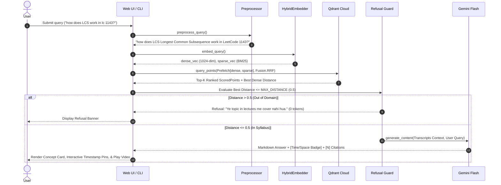
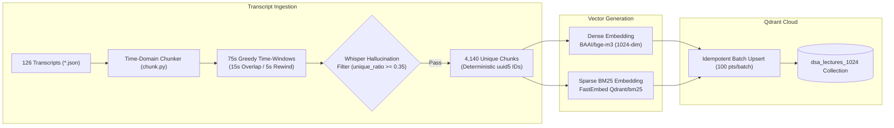

<div align="center">

# ⚡ ChronoRAG
### Timestamp-Accurate Video Intelligence & Hybrid RAG Platform for DSA

[](https://www.python.org/downloads/)
[](https://fastapi.tiangolo.com)
[](https://qdrant.tech)
[](https://ai.google.dev)
[](https://github.com/qdrant/fastembed)
[](LICENSE)

**ChronoRAG** is a timestamp-accurate Retrieval-Augmented Generation (RAG) platform built on a curriculum of 126 video lectures. It combines **Dense Semantic Embeddings** (`bge-m3`) with **FastEmbed Sparse Lexical Embeddings** (`Qdrant/bm25`), fused using **Reciprocal Rank Fusion (RRF)** in Qdrant Cloud. It pinpoints exact concept moments, answers conceptual queries in concise English with natural pedagogical Hinglish nuances, and jumps straight to the relevant lecture timestamps with video player synchronization.

---

</div>

## 📑 Table of Contents

- [Key Highlights](#-key-highlights)
- [System Architecture](#-system-architecture)
- [Retrieval & Synthesis Flow](#-retrieval--synthesis-flow)
- [Ingestion & Chunking Pipeline](#-ingestion--chunking-pipeline)
- [Project Directory Structure](#-project-directory-structure)
- [Quickstart & Installation](#-quickstart--installation)
- [CLI Reference](#-cli-reference)
- [API Endpoints](#-api-endpoints)
- [Guardrails & Token Optimization](#-guardrails--token-optimization)
- [Configuration Reference](#-configuration-reference)

---

## 🚀 Key Highlights

- **Hybrid Dense + Sparse Search (RRF)**: Merges dense semantic vectors (1024-dim `BAAI/bge-m3`) and sparse lexical vectors (`Qdrant/bm25`) through Qdrant's native `Prefetch` query pipeline and Reciprocal Rank Fusion.
- **Timestamp-Accurate Deep Linking**: Breaks continuous lecture audio into 75-second sliding windows with a 15-second overlap and a 5-second seek rewind (`seek_sec = max(0, start_sec - 5)`), ensuring smooth concept continuity.
- **DSA Acronym & LeetCode Normalizer**: Preprocesses queries dynamically (e.g., `LCS` $\to$ `LCS Longest Common Subsequence`, `lc 206` $\to$ `LeetCode 206`).
- **Zero-Token Out-of-Syllabus Refusal**: A strict cosine distance cutoff (`MAX_DISTANCE = 0.5`) aborts out-of-domain queries immediately without spending LLM tokens.
- **Concise English-First Synthesis**: Generates crisp, structured concept explanations (100–140 words max) using Google Gemini Flash, with standard time/space complexity badges (`[Time: O(...) | Space: O(...) | Pattern: ...]`).
- **Rich Web UI & Markdown Parser**: Renders interactive inline citation jump pins (`📍 [1]`), formatted mathematical equations (LaTeX transformed into styled formula cards), and synchronized YouTube player seeking.

---

## 🏛 System Architecture

The following diagram illustrates the end-to-end architecture across client interfaces, backend microservices, vector storage, and external foundation models:

```mermaid
flowchart TD
    subgraph Clients["Client Interfaces"]
        WebUI["Web Interface (Vanilla JS + Glassmorphism UI)"]
        CLI["CLI Harness (Typer + Rich)"]
    end

    subgraph Service["Backend API & Application Layer (FastAPI)"]
        APIRoutes["FastAPI REST Endpoints (/api/ask, /api/stats)"]
        Preproc["DSA Query Preprocessor (Acronyms + LeetCode)"]
        HybridEngine["HybridEmbedder (Singleton)"]
        DenseModel["Dense: BAAI/bge-m3 (1024-dim)"]
        SparseModel["Sparse: FastEmbed Qdrant/bm25"]
        Guard["Out-of-Syllabus Distance Guard (Cutoff = 0.5)"]
        AnswerSynth["Synthesis Engine (Gemini 3.5 Flash)"]
    end

    subgraph Storage["Vector Database (Qdrant Cloud)"]
        Qdrant[("Qdrant Cluster (dsa_lectures_1024)
        - Named Vector 'dense' (Cosine)
        - Named Vector 'sparse' (BM25)")]
    end

    subgraph ExtModels["External Intelligence & Media"]
        GeminiAPI["Google Gemini API (Thinking Budget = 0)"]
        YTPlayer["YouTube IFrame Embedded Player"]
    end

    WebUI -->|HTTP POST /api/ask| APIRoutes
    CLI -->|CLI Command tuberag find/ask| Preproc
    APIRoutes --> Preproc
    Preproc --> HybridEngine
    HybridEngine --> DenseModel
    HybridEngine --> SparseModel

    DenseModel -->|Dense Vector| Qdrant
    SparseModel -->|Sparse Vector| Qdrant

    Qdrant -->|Prefetch & RRF Ranked Points| Guard
    Guard -->|Distance > 0.5 (Refuse)| APIRoutes
    Guard -->|Distance <= 0.5 (Proceed)| AnswerSynth

    AnswerSynth -->|Prompt + Formatted Context| GeminiAPI
    GeminiAPI -->|Summary + Badge + Citations| AnswerSynth
    AnswerSynth --> APIRoutes
    APIRoutes -->|JSON Response| WebUI
    WebUI -->|Seek Video to start_sec - 5s| YTPlayer
```

---

## 🔄 Retrieval & Synthesis Flow

When a user submits a question, the query passes through normalization, dual-vector generation, fused ranking, threshold validation, and structured answer synthesis:



---

## 📦 Ingestion & Chunking Pipeline

Raw lecture transcripts are parsed, sanitized against Whisper repetition artifacts, windowed with playback rewinds, and indexed with deterministic UUIDs:



---

## 📂 Project Directory Structure

```text
ChronoRAG/
├── .env.example               # Environment template with configuration defaults
├── .gitignore                 # Excludes local environments, caches, and secrets
├── pyproject.toml             # Python packaging, uv dependencies, and entrypoints
├── config.py                  # Single source of truth for validated settings
├── models.py                  # Pydantic v2 immutable data models & schemas
├── preprocess.py              # DSA acronym dictionary & LeetCode query normalizer
├── chunk.py                   # Time-domain window chunker with repetition filtering
├── embed.py                   # Dense (bge-m3) and Sparse (BM25) HybridEmbedder
├── index.py                   # Qdrant collection lifecycle, batch upsert, & RRF search
├── answer.py                  # Gemini synthesis engine, refusal guard, badge parser
├── cli.py                     # Typer CLI (reindex, stats, search, find, ask)
├── smoke_test.py              # Automated 5-stage validation test harness
├── transcripts/               # 126 lecture JSON transcript files
├── api/
│   ├── __init__.py
│   └── main.py                # FastAPI REST API with lifespan model warm-up
└── frontend/
    └── index.html             # Single-page interface with YouTube player sync
```

---

## ⚡ Quickstart & Installation

### Prerequisites
- Python 3.12 or higher
- [uv](https://docs.astral.sh/uv/) (recommended) or standard `pip`
- A [Qdrant Cloud](https://cloud.qdrant.io/) cluster URL and API key
- A [Google AI Studio](https://aistudio.google.com/) Gemini API key

### 1. Clone the Repository
```bash
git clone https://github.com/matrix-1407/chronoRAG.git
cd chronoRAG
```

### 2. Set Up Virtual Environment & Dependencies
Using `uv`:
```bash
uv sync
```
Or using standard `pip`:
```bash
python -m venv .venv
source .venv/bin/activate  # On Windows: .venv\Scripts\activate
pip install -e .
```

### 3. Configure Environment Variables
Create your local `.env` from `.env.example`:
```bash
cp .env.example .env
```
Fill in your credentials in `.env`:
```env
GOOGLE_API_KEY=your_gemini_api_key
QDRANT_URL=https://your-cluster-id.us-east4-0.gcp.cloud.qdrant.io:6333
QDRANT_API_KEY=your_qdrant_api_key
```

### 4. Index the Transcripts (Phase 2 Hybrid Index)
Run the ingestion pipeline to chunk all 126 lectures, compute dense + BM25 embeddings, and populate Qdrant Cloud:
```bash
uv run python cli.py reindex --force
```

### 5. Launch the Web Application
Start the FastAPI server:
```bash
uv run uvicorn api.main:app --reload
```
Open your browser at **`http://127.0.0.1:8000`**.

---

## 💻 CLI Reference

ChronoRAG includes a CLI built with Typer and Rich:

| Command | Description | Example |
|---|---|---|
| `tuberag reindex` | Chunks transcripts and uploads dense + sparse vectors to Qdrant | `uv run python cli.py reindex --force` |
| `tuberag stats` | Displays collection size, vector dimensions, and chunk ratios | `uv run python cli.py stats` |
| `tuberag find` | Executes hybrid search and displays RRF, dense, and sparse scores | `uv run python cli.py find "BFS traversal in graphs"` |
| `tuberag ask` | Runs the full RAG pipeline: retrieval, distance cutoff, and Gemini answer | `uv run python cli.py ask "Dijkstra algorithm kaise kaam karta hai?"` |

---

## 🌐 API Endpoints

### `POST /api/ask`
Full hybrid RAG synthesis pipeline.

**Request Payload:**
```json
{
  "query": "how does binary search work?",
  "top_k": 5
}
```

**Response Payload:**
```json
{
  "answer": "Binary Search is a divide-and-conquer algorithm used on sorted arrays [1]...",
  "complexity_badge": {
    "time_complexity": "O(log N)",
    "space_complexity": "O(1)",
    "pattern": "Divide and Conquer / Two Pointers"
  },
  "citations": [
    {
      "video_id": "ABC123xyz",
      "title": "Lecture 12 - Binary Search Fundamentals",
      "start_sec": 340.0,
      "seek_sec": 335.0,
      "youtube_url": "https://www.youtube.com/watch?v=ABC123xyz&t=335s",
      "chunk_preview": "jab array sorted ho tab hum middle element check karte hain...",
      "distance": 0.284
    }
  ],
  "retrieval_distance": 0.284,
  "tokens_used": 194,
  "is_refused": false,
  "query_processed": "how does binary search work?",
  "latency_ms": 4120
}
```

### `GET /api/stats`
Returns point counts, chunk counts, and collection health metrics.

---

## 🛡 Guardrails & Token Optimization

1. **Deterministic Refusal Cutoff (`MAX_DISTANCE = 0.5`)**:
   - The cosine distance between the user query and the best dense retrieval match is evaluated before invoking Gemini.
   - If the best match distance exceeds `0.5`, the query is flagged as out-of-syllabus and immediately returns `"Ye topic in lectures me cover nahi hua."` with `tokens_used: 0`.
2. **Zero-Thinking Budget (`thinking_budget = 0`)**:
   - For Gemini models with thinking mode enabled by default, internal thought tokens can exhaust token limits and cause truncated answers. ChronoRAG configures `thinking_budget = 0`, keeping answers tight, fully formed, and returned in ~4-5s.
3. **Chunk Deduping & Repetition Filter**:
   - Whisper transcription loops (e.g. repeated words or silence loops) are discarded before embedding using a lexical compression ratio filter (`unique_ratio < 0.35`).

---

## ⚙️ Configuration Reference

All settings can be customized via `.env` or system environment variables:

| Variable | Default | Purpose |
|---|---|---|
| `GOOGLE_API_KEY` | *(required)* | Gemini API key for answer synthesis |
| `QDRANT_URL` | *(required)* | Qdrant Cloud cluster endpoint |
| `QDRANT_API_KEY` | *(required)* | Qdrant Cloud access token |
| `YTRAG_COLLECTION` | `dsa_lectures_1024` | Qdrant collection name |
| `YTRAG_EMBED_MODEL` | `BAAI/bge-m3` | Dense embedding model name (1024-dim) |
| `YTRAG_SPARSE_MODEL` | `Qdrant/bm25` | Sparse lexical model name via FastEmbed |
| `YTRAG_GEMINI_MODEL` | `gemini-3.5-flash` | Gemini synthesis model |
| `YTRAG_MAX_DISTANCE` | `0.5` | Cosine distance threshold for out-of-domain refusal |
| `YTRAG_CHUNK_SECONDS` | `75` | Target chunk window length in seconds |
| `YTRAG_CHUNK_OVERLAP` | `15` | Overlap between adjacent chunk windows in seconds |
| `YTRAG_LINK_REWIND` | `5` | Playback seek buffer (seconds) before chunk start |
| `YTRAG_MAX_OUTPUT_TOKENS` | `300` | Hard cap on LLM generation tokens |

---

<div align="center">

Built with ❤️ for learners mastering Data Structures & Algorithms.

</div>
